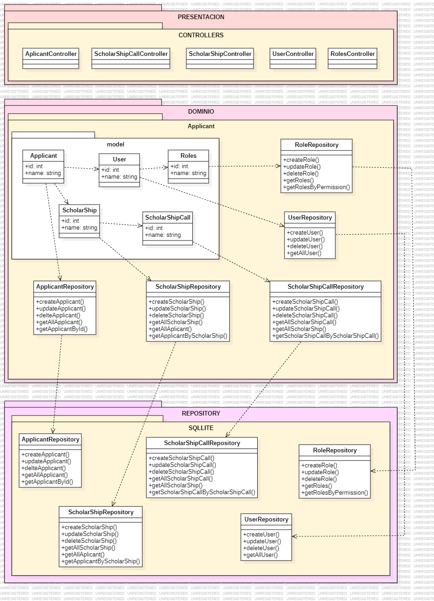

## 1. Descripción

El modelo de Gestión de Applicant se encarga de gestionar todos los aspectos relacionados con las usuarios, becas, convenios, docentes, todo ello relacionado a los postulantes, incluyendo la creación, actualización, consulta y eliminación de todo lo mencionado.

**Contexto Delimitado: Gestión de Applicant**

## 2. Arquitectura DDD

### 2.1. Capas de la Arquitectura

#### 2.1.1. Capa de Presentación

- **Controladores**
  - **ApplicantController**: Gestiona las operaciones CRUD (Crear, Leer, Actualizar, Eliminar) para los solicitantes del sistema. Utiliza la interfaz IApplicantService para delegar las operaciones de negocio y expone los siguientes endpoints HTTP: un GET para obtener todos los solicitantes, un GET con un ID para recuperar un solicitante específico, un POST para agregar un nuevo solicitante, un PUT con un ID para actualizar un solicitante existente y un DELETE con un ID para eliminar un solicitante. Cada método maneja respuestas HTTP apropiadas, incluyendo códigos de estado y mensajes de error cuando es necesario, asegurando una interacción clara y eficiente con el sistema.
  - **ScholarShipController**: Responsable de manejar las operaciones CRUD para las becas disponibles en el sistema mediante la interfaz IScholarshipService. Ofrece los siguientes endpoints HTTP: un GET para listar todas las becas, un GET con un ID para obtener detalles de una beca específica, un POST para crear una nueva beca, un PUT con un ID para actualizar una beca existente, y un DELETE con un ID para eliminar una beca. Los métodos garantizan respuestas HTTP adecuadas, reflejando el éxito o fracaso de las operaciones, y proporcionando mensajes de error cuando es necesario.
  - **ScholarShipCallController**: Encargado de gestionar las convocatorias de becas mediante la interfaz IScholarshipCallService. Proporciona endpoints HTTP que incluyen un GET para listar todas las convocatorias de becas, un GET con un ID para obtener detalles de una convocatoria específica, un POST para crear una nueva convocatoria, un PUT con un ID para actualizar una convocatoria existente, y un DELETE con un ID para eliminar una convocatoria. Cada operación responde con los códigos de estado HTTP correspondientes, garantizando una interacción clara y eficaz con los usuarios y manteniendo la integridad de los datos.
  - **UserController**: Maneja las operaciones relacionadas con los usuarios del sistema, utilizando IUserService para delegar la lógica de negocio. Ofrece los siguientes endpoints HTTP: un GET para obtener todos los usuarios, un GET con un ID para recuperar la información de un usuario específico, un POST para registrar un nuevo usuario, un PUT con un ID para actualizar los datos de un usuario existente, y un DELETE con un ID para eliminar un usuario. Los métodos aseguran respuestas HTTP adecuadas para cada operación, proporcionando mensajes de error y códigos de estado apropiados para facilitar la administración y acceso a los datos de los usuarios.
  - **RolesController**: responsable de las operaciones CRUD para los roles de usuario en el sistema, utilizando IRoleService para la lógica de negocio. Expone los siguientes endpoints HTTP: un GET para listar todos los roles disponibles, un GET con un ID para obtener detalles de un rol específico, un POST para crear un nuevo rol, un PUT con un ID para actualizar un rol existente, y un DELETE con un ID para eliminar un rol. Cada método está diseñado para responder con códigos de estado HTTP adecuados, asegurando una interacción eficiente con el sistema y proporcionando mensajes claros sobre el estado de las operaciones.

#### 2.1.2. Capa de Dominio

- **Entidades**
  - **ApplicantModel**: Entidad principal del sistema de gestión de usuarios, que incluye propiedades como Id, Name, Email y RememberKey.
  - **UserModel**: Entidad principal del sistema de gestión de usuarios, que incluye propiedades como Id, Name, Email y RememberKey.
  - **RolesModel**: Entidad derivada de UserModel, que representa al role .
  - **ScholarShipModel**: Representa una beca en el sistema, incluyendo propiedades como Id, Name, y Credits.
  - **ScholarShipCallModel**: Representa un convenio en el sistema, incluyendo propiedades como Id, Name, y Credits.

#### 2.1.3. Capa de Repositorio

- **Implementaciones de Repositorios**
  - **ApplicantRepository**: Implementa la interfaz IApplicantRepository y se encarga de gestionar el acceso a datos para los solicitantes utilizando MongoDB como sistema de almacenamiento. Este repositorio proporciona métodos para realizar operaciones CRUD, incluyendo GetAllApplicants para obtener todos los solicitantes, GetApplicantById para recuperar un solicitante específico por su ID, AddApplicant para agregar un nuevo solicitante al sistema, UpdateApplicant para actualizar los datos de un solicitante existente, y DeleteApplicant para eliminar un solicitante. La implementación garantiza una interacción eficiente con la base de datos, permitiendo el acceso rápido y seguro a la información de los solicitantes.
  - **UserRepository**: Implementa la interfaz IUserRepository y gestiona el acceso a datos para los usuarios utilizando MongoDB. Proporciona una serie de métodos para realizar operaciones CRUD en los datos de los usuarios, incluyendo GetAllUsers para listar todos los usuarios, GetUserById para obtener los detalles de un usuario específico por su ID, AddUser para registrar un nuevo usuario, UpdateUser para modificar la información de un usuario existente, y DeleteUser para eliminar un usuario del sistema. Este repositorio asegura que las operaciones de acceso a datos sean realizadas de manera eficiente y segura, optimizando el rendimiento del sistema y garantizando la integridad de los datos de usuario.
  - **RolesRepository**: Implementa IRolesRepository y es responsable de gestionar el acceso a datos para los roles de usuario en el sistema, utilizando MongoDB como base de datos. El repositorio ofrece métodos para llevar a cabo operaciones CRUD, incluyendo GetAllRoles para obtener todos los roles disponibles, GetRoleById para recuperar un rol específico por su ID, AddRole para crear un nuevo rol, UpdateRole para actualizar un rol existente, y DeleteRole para eliminar un rol. Estas funcionalidades permiten gestionar los roles de manera efectiva, asegurando que el acceso a los datos sea eficiente y conforme a las políticas de seguridad del sistema.
  - **ScholarShipRepository**: Implementa la interfaz IScholarshipRepository y maneja el acceso a datos para las becas en el sistema utilizando MongoDB. Este repositorio ofrece métodos para realizar operaciones CRUD, tales como GetAllScholarships para listar todas las becas, GetScholarshipById para obtener los detalles de una beca específica por su ID, AddScholarship para agregar una nueva beca al sistema, UpdateScholarship para actualizar los detalles de una beca existente, y DeleteScholarship para eliminar una beca. La implementación está diseñada para asegurar una interacción eficiente con la base de datos, permitiendo un acceso rápido y seguro a la información de las becas.
  - **ScholarShipCallRepository**: Implementa IScholarshipCallRepository y gestiona el acceso a datos para las convocatorias de becas utilizando MongoDB. Proporciona métodos para realizar operaciones CRUD, incluyendo GetAllScholarshipCalls para obtener todas las convocatorias de becas, GetScholarshipCallById para recuperar una convocatoria específica por su ID, AddScholarshipCall para crear una nueva convocatoria, UpdateScholarshipCall para actualizar una convocatoria existente, y DeleteScholarshipCall para eliminar una convocatoria. Este repositorio garantiza que las operaciones de acceso a datos sean realizadas de manera eficiente y segura, facilitando una gestión efectiva de las convocatorias de becas en el sistema.



## 3. Escenarios de Prueba de API 

### 3.1. Background: El endpoint "/api/register" es accesible y está disponible
#### 3.1.1 Escenario 1: Registrar exitosamente un applicante 
```
Escenario: Registrar exitosamente un usuario
      Given se proporciona una payload válida de datos
        {
            "fullName": "Juan Martinez",
            "userData": {
                "userName": "bananon",
                "password": "Aldechi@user",
                "confirmPassword": "Aldechi@user",
                "role": "Applicante"
            },
            "email": "aldechi@example.com",
            "phoneNumber": "123456789"
        }

      When se envía una solicitud POST a "/api/register"
      Then se recibe una respuesta válida con código 201
      And se recibe un mensaje de "Admin user created successfully"
```  

#### 3.1.1 Escenario 2: Fallar al registrar debido a datos inválidos.
```
Escenario: Fallar al registrar debido a datos inválidos
      Given se proporciona una payload válida de datos
        {
            "fullName": "Juan Martinez",
            "userData": {
                "userName": "bananon",
                "password": "Aldechi@user",
                "confirmPassword": "Aldechi@user",
                "role": "Applicante"
            },
            "email": "aldechi@example.com",
            "phoneNumber": "123456789"
        }

      When se envía una solicitud POST a "/api/Admin/register/admin"
      Then se recibe una respuesta con código 400
      And se recibe un respuesta formato JSON
      And se recibe un mensaje de "One or more validation errors occurred."
```  
### 3.2. Background: El endpoint "/api/{id}" es accesible y está disponible
#### 3.2.1 Escenario 1: Obtener exitosamente la información de un Applicante por ID
```  
Escenario: Obtener exitosamente la información de un Applicante por ID
      Given se proporciona un ID de Applicante válido
        {
            "id": "12345"
        }

      When se envía una solicitud GET a "/api/12345"
      Then se recibe una respuesta válida con código 200
      And se recibe un objeto JSON con la información del Applicante
```    
#### 3.2.2 Escenario 2: Fallar al obtener la información de un Applicante con un ID inválido
``` 
Escenario: Fallar al obtener la información de un Applicante con un ID inválido
      Given se proporciona un ID de Applicante no existente
        {
            "id": "99999"
        }

      When se envía una solicitud GET a "/api/99999"
      Then se recibe una respuesta con código 404
      And se recibe un mensaje de "Applicant not found"
``` 

### 3.3. Background: El endpoint "/api/all" es accesible y está disponible
#### 3.3.1 Escenario 1: Obtener exitosamente la lista de todos los Applicantes
``` 
Escenario: Obtener exitosamente la lista de todos los Applicantes
      Given el sistema contiene múltiples Applicantes registrados

      When se envía una solicitud GET a "/api/all"
      Then se recibe una respuesta válida con código 200
      And se recibe una lista JSON de Applicantes
``` 
#### 3.3.2 Escenario 2: Obtener una lista vacía cuando no hay Applicantes registrados
``` 
Escenario: Obtener una lista vacía cuando no hay Applicantes registrados
      Given no hay Applicantes registrados en el sistema

      When se envía una solicitud GET a "/api/all"
      Then se recibe una respuesta válida con código 200
      And se recibe una lista JSON vacía
```

### 3.4. Background: El endpoint "/api/{id}/scholarship" es accesible y está disponible
#### 3.4.1 Escenario 1: Obtener exitosamente la beca de un Applicante por ID
``` 
Escenario: Obtener exitosamente la beca de un Applicante por ID
      Given se proporciona un ID de Applicante válido que tiene beca
        {
            "id": "12345"
        }

      When se envía una solicitud GET a "/api/12345/scholarship"
      Then se recibe una respuesta válida con código 200
      And se recibe un objeto JSON con los detalles de la beca
``` 

#### 3.4.2 Escenario 2: Fallar al obtener la beca de un Applicante sin beca
```
Escenario: Fallar al obtener la beca de un Applicante sin beca
      Given se proporciona un ID de Applicante válido que no tiene beca
        {
            "id": "54321"
        }

      When se envía una solicitud GET a "/api/54321/scholarship"
      Then se recibe una respuesta con código 404
      And se recibe un mensaje de "Scholarship not found"
```

#### 3.4.3 Escenario 3: Fallar al obtener la beca con un ID de Applicante inválido
```
Escenario: Fallar al obtener la beca con un ID de Applicante inválido
      Given se proporciona un ID de Applicante no existente
        {
            "id": "99999"
        }

      When se envía una solicitud GET a "/api/99999/scholarship"
      Then se recibe una respuesta con código 404
      And se recibe un mensaje de "User not found"
```
