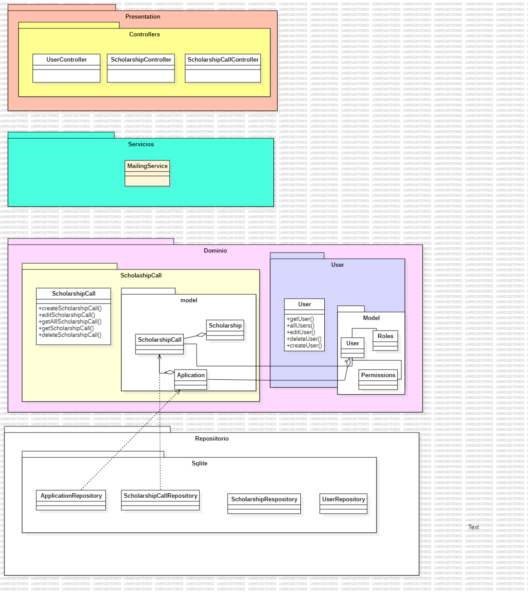

## 1. Descripción

El modelo de Gestión de ScholarshipCall se encarga de administrar todos los aspectos relacionados con las convocatorias de becas, incluyendo usuarios, becas y solicitantes. Esto incluye la creación, actualización, consulta y eliminación de convocatorias de becas, así como la gestión de usuarios y solicitantes asociados.

**Contexto Delimitado: Gestión de ScholarshipCall**

## 2. Arquitectura DDD

### 2.1. Capas de la Arquitectura

#### 2.1.1. Capa de Presentación

**Controladores** - **ScholarshipCallController**: Encargado de gestionar las operaciones CRUD (Crear, Leer, Actualizar, Eliminar) para las convocatorias de becas en el sistema. Utiliza la interfaz `IScholarshipCallService` para delegar las operaciones de negocio y expone los siguientes endpoints HTTP: un `GET` para obtener todas las convocatorias de becas, un `GET` con un `ID` para recuperar una convocatoria específica, un `POST` para agregar una nueva convocatoria, un `PUT` con un `ID` para actualizar una convocatoria existente, y un `DELETE` con un `ID` para eliminar una convocatoria. Cada método maneja respuestas HTTP apropiadas, incluyendo códigos de estado y mensajes de error cuando es necesario, asegurando una interacción clara y eficiente con el sistema. - **ApplicantController**: Gestiona las operaciones CRUD para los solicitantes del sistema mediante la interfaz `IApplicantService`. Proporciona los siguientes endpoints HTTP: un `GET` para listar todos los solicitantes, un `GET` con un `ID` para obtener detalles de un solicitante específico, un `POST` para agregar un nuevo solicitante, un `PUT` con un `ID` para actualizar un solicitante existente, y un `DELETE` con un `ID` para eliminar un solicitante. Los métodos garantizan respuestas HTTP adecuadas, reflejando el éxito o fracaso de las operaciones, y proporcionando mensajes de error cuando es necesario. - **UserController**: Maneja las operaciones relacionadas con los usuarios del sistema utilizando `IUserService` para delegar la lógica de negocio. Ofrece los siguientes endpoints HTTP: un `GET` para obtener todos los usuarios, un `GET` con un `ID` para recuperar la información de un usuario específico, un `POST` para registrar un nuevo usuario, un `PUT` con un `ID` para actualizar los datos de un usuario existente, y un `DELETE` con un `ID` para eliminar un usuario. Los métodos aseguran respuestas HTTP adecuadas para cada operación, proporcionando mensajes de error y códigos de estado apropiados para facilitar la administración y acceso a los datos de los usuarios. - **ScholarshipController**: Responsable de manejar las operaciones CRUD para las becas disponibles en el sistema mediante la interfaz `IScholarshipService`. Ofrece los siguientes endpoints HTTP: un `GET` para listar todas las becas, un `GET` con un `ID` para obtener detalles de una beca específica, un `POST` para crear una nueva beca, un `PUT` con un `ID` para actualizar una beca existente, y un `DELETE` con un `ID` para eliminar una beca. Los métodos garantizan respuestas HTTP adecuadas, reflejando el éxito o fracaso de las operaciones, y proporcionando mensajes de error cuando es necesario.

#### 2.1.2. Capa de Dominio

**Entidades**

-   **ScholarshipCallModel**: Representa una convocatoria de beca en el sistema, incluyendo propiedades como `Id`, `Name`, `Description`, `StartDate`, `EndDate`, `BecaId` y `Status`.
-   **ApplicantModel**: Entidad que representa a los solicitantes, incluyendo propiedades como `UserId`, `SchoolarshiCallId`, `Status`, y `Start_Date`.
-   **UserModel**: Entidad que representa a los usuarios del sistema, con propiedades como `Id`, `Name`, `Email`, `Role` y `ScholarshipCallID`.
-   **ScholarshipModel**: Representa una beca en el sistema, incluyendo propiedades como `Id`, `Name`, `Description`.

#### 2.1.3. Capa de Repositorio

-   **Implementaciones de Repositorios**
    -   **ScholarshipaRepository**: Implementación de `ScholarshipCallRepository` ayuda a gestionae el acceso a datos para las convocatorias de becas utilizando sqlite y EloquentORM. Proporciona métodos para realizar operaciones CRUD, incluyendo `->all()` para obtener todas las convocatorias de becas, `->find('ID')` para recuperar una convocatoria específica por su ID, `create([])` para crear una nueva convocatoria, `update()` para actualizar una convocatoria existente, y `delete()` para eliminar una convocatoria. Este repositorio garantiza que las operaciones de acceso a datos sean realizadas de manera eficiente y segura, facilitando una gestión efectiva de las convocatorias de becas en el sistema.
    -   **ApplicantRepository**: Implementación de `ApplicantRepository` y se encarga de gestionar el acceso a datos para los solicitantes utilizando sqlite como sistema de almacenamiento y Eloquent como ORM.
    -   **UserRepository**: Implementación de `UserRepository` y gestiona el acceso a datos para los usuarios utilizando SqLite.
    -   **ScholarshipRepository**: Implementa la interfaz `ScholarshipRepository` y maneja el acceso a datos para las becas en el sistema utilizando SqLite.
        

## 3. Escenarios de Prueba de API

### 3.1. Background: Endpoints para la gestión de convocatoria

#### 3.1.1 Escenario 1: Creada exitosamente una convocatoria

```
Escenario: Crear exitosamente una convocatoria
      Given se proporciona una payload válida de datos
        {
            "description": "Convocatoria para beca de estudios",
            "startDate": "2024-09-01",
            "endDate": "2024-12-31",
            "scholarshipId": 1
        }

      When se envía una solicitud POST a "/api/convocatoria"
      Then se recibe una respuesta válida con código 201
      And se recibe un mensaje de "Convocatoria creada exitosamente"
      And se reciben los datos de la beca creada
        {
            "id": 1,
            "name": "Nombre de la beca - septiembre 2024",
            "description": "Convocatoria para beca de estudios",
            "startDate": "2024-09-01",
            "endDate": "2024-12-31",
            "scholarshipId": 1
        }

```

#### 3.1.2 Escenario 2: Obtener todas las convocatorias

```
Escenario: Obtener todas las convocatorias
      Given no se requiere payload
      When se envía una solicitud GET a "/api/convocatorias"
      Then se recibe una respuesta válida con código 200
      And se reciben los datos de todas las convocatorias
        [
            {
                "id": 1,
                "name": "Nombre de la beca - septiembre 2024",
                "description": "Convocatoria para beca de estudios",
                "startDate": "2024-09-01",
                "endDate": "2024-12-31",
                "scholarshipId": 1
            },
        ]

```

#### 3.1.3 Escenario 3: Obtener beca por ID

```
Escenario: Obtener una convocatoria por ID
      Given el ID de la convocatoria existe
      When se envía una solicitud GET a "/api/convocatoria/{id}"
      Then se recibe una respuesta válida con código 200
      And se reciben los datos de la convocatoria
        {
            "id": 1,
            "name": "Nombre de la beca - septiembre 2024",
            "description": "Convocatoria para beca de estudios",
            "startDate": "2024-09-01",
            "endDate": "2024-12-31",
            "scholarshipId": 1
        }

```

#### 3.1.4 Escenario 4: Editar una beca exitosamente

```
Escenario: Editar exitosamente una convocatoria
      Given se proporciona una payload válida de datos y el usuario tiene rol admin
        {
            "description": "Convocatoria para beca de maestría",
            "startDate": "2024-10-01",
            "endDate": "2025-03-31",
            "scholarshipId": 1
        }

      When se envía una solicitud PUT a "/api/convocatoria/{id}"
      Then se recibe una respuesta válida con código 200
      And se recibe un mensaje de "Convocatoria actualizada exitosamente"
      And se reciben los datos de la beca actualizada
        {
            "id": 1,
            "name": "Nombre de la beca - octubre 2024",
            "description": "Convocatoria para beca de maestría",
            "startDate": "2024-10-01",
            "endDate": "2025-03-31",
            "scholarshipId": 1
        }
```

#### 3.1.5 Escenario 5: Eliminart una beca exitosamente

```
Escenario: Eliminar exitosamente una convocatoria
      Given el ID de la convocatoria existe y el usuario tiene rol admin
      When se envía una solicitud DELETE a "/api/convocatoria/{id}"
      Then se recibe una respuesta válida con código 200
      And se recibe un mensaje de "Convocatoria eliminada exitosamente"
```

### 3.2. Background: Endpoints para la gestión de aplicaciones

#### 3.2.1. Escenario 6: Aplicar a una beca de forma exitosa

```
Escenario: Aplicar exitosamente a una beca
      Given la convocatoria está activa y el usuario tiene el rol de aplicante y no es beneficiario de una beca
      When se envía una solicitud POST a "/api/postulaciones/convocatoria/{convocatoriaId}/{userId}"
      Then se recibe una respuesta válida con código 201
      And se recibe un mensaje de "Postulación creada exitosamente"
      And se recibe un mensaje de "Email enviado satisfactoriamente"
      And se reciben los datos de la postulación
        {
            "userId": "{userId}",
            "scholarshipId": "{scholarshipId}",
            "startDate": "{fechaActual}"
        }
```

#### 3.2.2. Escenario 7: Aplicar a una beca con convocatoria caducada

```
Escenario: Aplicar a una beca con convocatoria caducada
      Given la convocatoria ha caducado y el usuario tiene el rol de aplicante y no es beneficiario de una beca
      When se envía una solicitud POST a "/api/postulaciones/convocatoria/{convocatoriaId}/{userId}"
      Then se recibe una respuesta válida con código 400
      And se recibe un mensaje de "La convocatoria ha caducado"
```

#### 3.2.3. Escenario 8: Aplicar a una beca no siendo postulante

```
Escenario: Aplicar a una beca con rol de admin
      Given la convocatoria está activa y el usuario tiene el rol de admin
      When se envía una solicitud POST a "/api/postulaciones/convocatoria/{convocatoriaId}/{userId}"
      Then se recibe una respuesta válida con código 403
      And se recibe un mensaje de "Solo los usuarios con rol de aplicante pueden aplicar a una beca"
```

#### 3.2.4. Escenario 9: Aplicar a una beca Siendo ya beneficiario

```
Escenario: Aplicar a una beca siendo ya beneficiario
      Given la convocatoria está activa y el usuario tiene el rol de aplicante pero ya es beneficiario de una beca
      When se envía una solicitud POST a "/api/postulaciones/convocatoria/{convocatoriaId}/{userId}"
      Then se recibe una respuesta válida con código 400
      And se recibe un mensaje de "El usuario ya es beneficiario de una beca"
```
