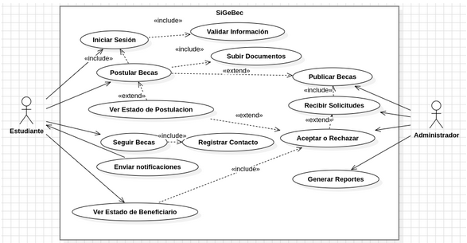
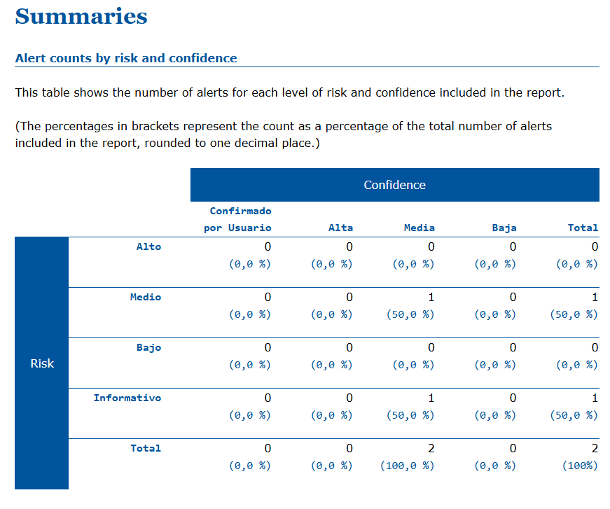
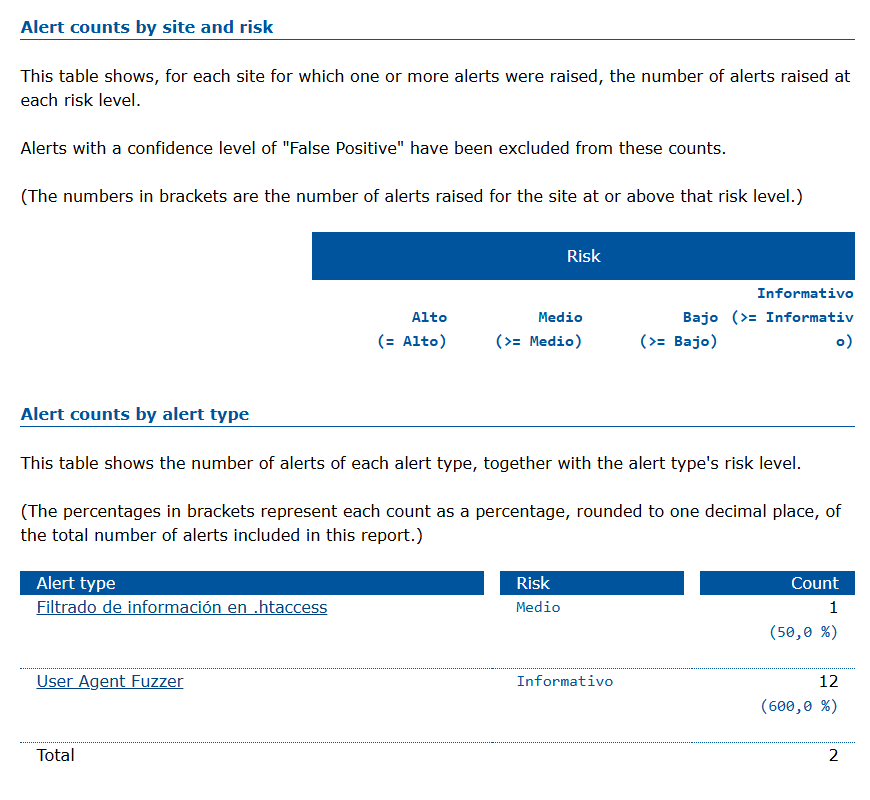
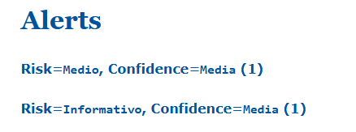

## Sistema de Gestión de Becas (SiGeBec)

## Propósito

El sistema, SiGeBec, tiene como objetivo principal facilitar el acceso y la gestión de becas educativas a través de una plataforma digital interactiva, diseñada específicamente para usuarios que tengan el objetivo de ser beneficiarios (estudiantes) por la PRONABEC y otras entidades educativas en Perú. Asimismo, este sistema será utilizado por administradores de la PRONABEC para la publicación de Becas, recibimiento y evaluación de solicitudes para finalmente seleccionar a los estudiantes que se convertirán en beneficiarios.

## Equipo:

-   Gustavo Ccama Marron
-   Juan Diego Huamani Vilca
-   Victor Alejandro Quicaño Miranda
-   Kevin Joaquin Chambi Tapia

## Cliente:

PRONABEC

## Perspectiva de Producto

<p align="center">
  
</p>

## Alcance

El proyecto SiGeBec abarcará las siguientes actividades y funcionalidades:

1. **Desarrollo del Sistema de Gestión de Usuarios**

    - Registro y autenticación de usuarios (estudiantes, padres, docentes, administradores).
    - Gestión de perfiles y permisos según roles de usuario.

2. **Sistema de Solicitud y Seguimiento de Becas**

    - Funcionalidades para que los estudiantes puedan aplicar a becas.
    - Subida de documentos necesarios para completar las aplicaciones.
    - Seguimiento del estado de las aplicaciones de becas.

3. **Notificaciones Automatizadas**

    - Envío de alertas sobre fechas importantes.
    - Notificaciones sobre cambios en el estado de las solicitudes.
    - Otros avisos relevantes para usuarios del sistema.

4. **Administración de Becas**

    - Herramientas para que los administradores gestionen las becas.
    - Evaluación de solicitudes de becas.
    - Publicación de nuevos programas de becas.

5. **Generación de Reportes**

    - Capacidades para crear y visualizar informes sobre el uso del sistema.
    - Análisis de las becas otorgadas y su impacto.

6. **Seguridad de Datos**

    - Implementación de medidas de seguridad como encriptación de datos.
    - Autenticación de dos factores para mejorar la seguridad del acceso.

7. **Compatibilidad y Usabilidad**
    - Asegurar que el sistema sea compatible con los principales navegadores web.
    - Adaptabilidad a dispositivos móviles.
    - Interfaz intuitiva y fácil de usar.

## Tecnologías Utilizadas

-   **Alpine.js 3.14**: Un marco minimalista para componer comportamiento de JavaScript en tu HTML.
-   **Composer**: Un gestor de dependencias para PHP.
-   **JavaScript**: El lenguaje de programación utilizado para el scripting del lado del cliente.
-   **npm**: Node Package Manager, utilizado para gestionar paquetes de JavaScript.
-   **PHP**: Un popular lenguaje de scripting de propósito general, especialmente adecuado para el desarrollo web.
-   **PostCSS 8.4**: Una herramienta para transformar CSS con plugins de JavaScript.
-   **Sass 1.77**: Un lenguaje de preprocesador que se interpreta o compila en CSS.
-   **Tailwind CSS 3.4**: Un marco CSS de utilidad primero para construir interfaces de usuario personalizadas rápidamente.
-   **Vite 5.0**: Una herramienta de construcción que busca proporcionar una experiencia de desarrollo más rápida y ligera para proyectos web modernos.

## Vista General de la Arquitectura

El proyecto sigue una arquitectura moderna de desarrollo web, que incluye:

-   **Frontend**: Construido utilizando JavaScript, Alpine.js y Tailwind CSS para una interfaz de usuario receptiva e interactiva.
-   **Backend**: Impulsado por PHP, gestionando la lógica del lado del servidor y las interacciones con la base de datos.
-   **Herramientas de Construcción**: Vite se utiliza para empaquetar y optimizar los recursos del frontend, mientras que npm y Composer gestionan las dependencias de JavaScript y PHP respectivamente.
-   **Estilos**: PostCSS y Sass se utilizan para procesar y mejorar CSS.
-   **Gestión de Dependencias**: Composer se encarga de las dependencias de PHP y npm de las dependencias de JavaScript.
-   **Procesamiento de CSS**: PostCSS y Sass permiten escribir CSS moderno y modular, que luego es procesado para compatibilidad y optimización.
-   **Optimización y Construcción**: Vite se encarga de la construcción y optimización de los recursos del frontend, proporcionando una experiencia de desarrollo rápida y eficiente.

## Domain-driven design

-   [Usuarios DDD](./Docs/UserModel/README.md)
-   [Beca DDD](./Docs/Scholarship/README.md)
-   [Convocatoria DDD](./Docs/ScholarshipCall/README.md)
-   [Postulaciones DDD](./Docs/Applicant/README.md)

## Instrucciones de Instalación

1. **Clonar el repositorio**:

    ```sh
    git clone https://github.com/tuusuario/tuproyecto.git
    cd tuproyecto
    ```

2. **Instalar dependencias de PHP**:

    ```sh
    composer install
    ```

3. **Instalar dependencias de JavaScript**:

    ```sh
    npm install
    ```

4. **Construir los recursos**:
    ```sh
    npm run build
    ```

## Principios SOLID

### 1. Single Responsibility Principle

Este principio establece que una clase debe tener una sola responsabilidad o razón para cambiar por ejemplo "AuthController" cumple con el Single Responsibility Principle (SRP) porque cada uno de sus métodos tiene una única responsabilidad dentro del contexto de la autenticación de usuarios:

-   login: Gestiona el inicio de sesión de los usuarios.
-   logout: Se encarga de cerrar la sesión del usuario.
-   forgotPassword: Envía un enlace para restablecer la contraseña.
-   updatePassword: Actualiza la contraseña del usuario.

Al mantener cada método enfocado en una tarea específica, el controlador es más fácil de entender y mantener.

#### 1.1. Codigo:

```php
class AuthController extends Controller
{
    public function login(LoginRequest $request)
    {
        $data = $request->validated();
        if (auth()->attempt($data)) {
            if (!auth()->user()->hasVerifiedEmail()) {
                auth()->logout();
                return back()->with('error', 'You need to verify your email address before logging in.');
            }
            return redirect()->route('home')->with('success', 'You have been logged in!');
        }
        return back()->with('error', 'Invalid credentials');
    }

    public function logout(Request $request): RedirectResponse
    {
        Auth::logout();

        $request->session()->invalidate();

        $request->session()->regenerateToken();
        return redirect()->route('login')->with('success', 'You have been logged out!');
    }

    public function forgotPassword(Request $request)
    {
        $request->validate(['email' => 'required|email']);

        $status = Password::sendResetLink(
            $request->only('email')
        );

        return $status === Password::RESET_LINK_SENT
            ? back()->with(['status' => __($status)])
            : back()->withErrors(['email' => __($status)]);
    }

    public function updatePassword(Request $request)
    {
        $request->validate([
            'token' => 'required',
            'email' => 'required|email',
            'password' => 'required|min:8|confirmed',
        ]);

        $status = Password::reset(
            $request->only('email', 'password', 'password_confirmation', 'token'),
            function (User $user, string $password) {
                $user->forceFill([
                    'password' => Hash::make($password)
                ])->setRememberToken(Str::random(60));

                $user->save();

                event(new PasswordReset($user));
            }
        );

        return $status === Password::PASSWORD_RESET
            ? redirect()->route('login')->with('status', __($status))
            : back()->withErrors(['email' => [__($status)]]);
    }
}
```

### 2. Open/Closed Principle

El componente CreateScholarship sigue el Open/Closed Principle (OCP), permitiendo que su funcionalidad sea extendida sin modificar el código existente. Esto se logra a través de:

-   Eventos: Usa el evento scholarship-created para permitir que otras partes del sistema escuchen y respondan sin modificar el componente.
-   Despacho de eventos: El método $this->dispatch('scholarship-created') facilita la adición de nuevas funcionalidades mediante la escucha de eventos en lugar de cambiar el código del componente.

Estos enfoques aseguran que el componente sea flexible y extensible, alineándose con el OCP al estar abierto para extensión pero cerrado para modificación.

#### 2.1. Codigo:

```php
class CreateScholarship extends Component
{
    #[Validate('required')]
    public string $name;
    #[Validate('required')]
    public string $description;
    public bool $modalOpen = false;

    #[On('scholarship-created')]
    public function closeModal()
    {
        $this->modalOpen = false;
    }

    public function render()
    {
        return view('livewire.modals.create-scholarship');
    }

    public function createscholarship()
    {
        $this->validate();
        Scholarship::create($this->pull());
        $this->reset();
        $this->description = '';
        $this->dispatch('scholarship-created', ['message' => 'Scholarship created successfully!']);
    }
}
```

### 4. Interface Segregation Principle

Este principio establece que los clientes no deberían verse obligados a depender de interfaces que no utilizan. Esto significa que una clase no debería implementar interfaces que no necesita. El Modelo "User" implementa solo la interfaz CanResetPassword, asegurando que no dependa de interfaces innecesarias. También utiliza los traits necesarios (HasFactory, Notifiable, HasRoles, HasApiTokens), lo que demuestra una implementación cuidadosa del ISP.

#### 4.1. Codigo:

```php
class User extends Authenticatable implements CanResetPassword
{
    use HasFactory, Notifiable, HasRoles, HasApiTokens;

    protected $fillable = [
        'name',
        'email',
        'password',
    ];

    protected $hidden = [
        'password',
        'remember_token',
    ];

    protected function casts(): array
    {
        return [
            'email_verified_at' => 'datetime',
            'password' => 'hashed',
        ];
    }

    public static function applicants()
    {
        return self::role('applicant');
    }

    public function scholarship(): HasOne
    {
        return $this->hasOne(Scholarship::class);
    }
}
```

## Pruebas de APIs

Para realizar pruebas de las APIs, se recomienda utilizar herramientas como Postman o Insomnia. Asegúrate de que el servidor esté en funcionamiento y utiliza las siguientes rutas para probar las diferentes funcionalidades del sistema.
[Pruebas de APIs](pruebas.md)

## Pruebas de Rendimiento

Para evaluar el rendimiento del sistema, se pueden utilizar herramientas como Apache JMeter o k6. Estas herramientas permiten simular múltiples usuarios y medir el tiempo de respuesta del sistema bajo diferentes cargas.

| Etiqueta               | # Muestras | Media | Mín   | Máx   | Desv. Estándar | % Error | Rendimiento | Kb/sec | Sent KB/sec | Media de Bytes |
| ---------------------- | ---------- | ----- | ----- | ----- | -------------- | ------- | ----------- | ------ | ----------- | -------------- |
| Login                  | 100        | 5808  | 161   | 11435 | 3298.50        | 0.000%  | 8.04959     | 29.27  | 0.95        | 3723.0         |
| Dashboard              | 100        | 23422 | 13509 | 24712 | 1791.88        | 0.000%  | 2.70468     | 13.77  | 0.65        | 5215.0         |
| Ver Becas              | 100        | 13831 | 12070 | 14363 | 529.01         | 0.000%  | 2.65491     | 26.70  | 0.33        | 10299.0        |
| Solicitar Becas        | 100        | 27128 | 26649 | 27665 | 300.37         | 0.000%  | 1.90905     | 9.72   | 0.46        | 5215.0         |
| Convocatorias de Becas | 100        | 24618 | 23383 | 26728 | 1091.58        | 0.000%  | 2.04687     | 10.42  | 0.50        | 5215.0         |

### Grafico

<p align="center">
  
</p>

## Pruebas de Seguridad

Para garantizar la seguridad del sistema, se deben realizar pruebas de penetración y análisis de vulnerabilidades utilizando herramientas como OWASP ZAP o Burp Suite. Estas pruebas ayudarán a identificar y corregir posibles fallos de seguridad en el sistema.

### OWASP ZAP




