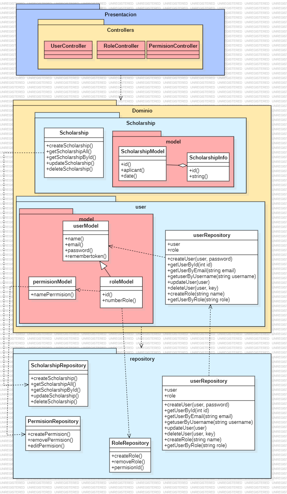

## 1. Descripción

El modelo de usuarios se encarga de manejar todas las operaciones relacionadas con la administración de usuarios en el sistema. Esto incluye la creación, actualización, consulta y eliminación de usuarios.

**Contexto Delimitado: Gestión de Usuarios**

## 2. Arquitectura DDD

### 2.1. Capas de la Arquitectura

#### 2.1.1. Capa de Presentación

- **Controladores**
  - **AdminController**: Gestiona las solicitudes HTTP relacionadas con usuarios con el rol de ADMIN. Incluye métodos para crear, actualizar, obtener y eliminar usuarios, delegando la lógica correspondiente a los servicios de aplicación.
  - **ApplicantController**: Gestiona las solicitudes HTTP relacionadas con usuarios con el rol de APPLICANT. Incluye únicamente métodos de lectura (GET), delegando la lógica a los servicios de aplicación.

#### 2.1.2. Capa de Dominio

- **Entidades**
  - **AcademicPerformance**: Enum que define el estado del estudiante en la beca en la cual esta inscrito.
  - **UserModel**: Entidad principal del sistema de gestión de usuarios, que incluye propiedades como Id, Name, Email y RememberKey.
  - **AdminModel**: Entidad derivada de UserModel, que representa al usuario administrador y añade propiedades como PhoneNumber.
  - **StudentModel**: Entidad derivada de UserModel, que representa al usuario aplicante y contiene propiedades como Applicant, Credit, ApplicantScholarShip, y ApplicantScholarShipCall.
  - **ScholarShipModel**: Entidad que almacena información sobre los cursos llevados por el aplicante, incluyendo propiedades como Id, StudentId, y ScholarshipInfo.

- **Agregados**
  - **ApplicantScholarship**: Agrupa entidades y objetos de valor relacionados con los cursos de un aplicante, garantizando la consistencia interna del agregado.

- **Interfaces de Repositorio**
  - **UserRepository**: Define los métodos necesarios para la gestión de usuarios en el repositorio, como AddUser, UpdateUser, GetUserById, y DeleteUser.
  - **ScholarshipRepository**: Define los métodos necesarios para la gestión de cursos en el repositorio, como AddScholarship, UpdateScholarship, GetScholarshipById, y DeleteScholarship.

#### 2.1.3. Capa de Repositorio

- **Implementaciones de Repositorios**
  - **UserRepository**: Implementación concreta de `UserRepository`, que utiliza el contexto de la base de datos para realizar operaciones CRUD sobre los usuarios.
  - **ScholarshipRepository**: Implementación concreta de `ScholarshipRepository`, que utiliza el contexto de la base de datos para realizar operaciones CRUD sobre las becas.



## 3. Escenarios de Prueba de API 

### 3.1. Background: El endpoint "/api/register" es accesible y está disponible
#### 3.1.1 Escenario 1: Registrar exitosamente un usuario o  administrador.
```
Escenario: Registrar exitosamente un usuario
      Given se proporciona una payload válida de datos
        {
            "fullName": "Juan Martinez",
            "userData": {
                "userName": "bananon",
                "password": "Aldechi@user",
                "confirmPassword": "Aldechi@user",
                "role": "User"
            },
            "email": "aldechi@example.com",
            "phoneNumber": "123456789"
        }

      When se envía una solicitud POST a "/api/register"
      Then se recibe una respuesta válida con código 201
      And se recibe un mensaje de "Admin user created successfully"
```  
```
Escenario: Registrar exitosamente un usuario
      Given se proporciona una payload válida de datos
        {
            "fullName": " Benito Martinez",
            "userData": {
                "userName": "Juan Ale",
                "password": "Ale@123",
                "confirmPassword": "Ale@123",
                "role": "Admin"
            },
            "email": "aAle001@example.com",
            "phoneNumber": "123456789"
        }

      When se envía una solicitud POST a "/api/register"
      Then se recibe una respuesta válida con código 201
      And se recibe un mensaje de "Admin user created successfully"
```  
#### 3.1.1 Escenario 2: Fallar al registrar debido a datos inválidos.
```
Escenario: Fallar al registrar debido a datos inválidos
      Given se proporciona una payload válida de datos
        {
            "fullName": "Juan Martinez",
            "userData": {
                "userName": "bananon",
                "password": "Aldechi@user",
                "confirmPassword": "Aldechi@user",
                "role": "User"
            },
            "email": "aldechi@example.com",
            "phoneNumber": "123456789"
        }

      When se envía una solicitud POST a "/api/Admin/register/admin"
      Then se recibe una respuesta con código 400
      And se recibe un respuesta formato JSON
      And se recibe un mensaje de "One or more validation errors occurred."
```  
```
Escenario: Registrar exitosamente un usuario
      Given se proporciona una payload válida de datos
        {
            "fullName": " Benito Martinez",
            "userData": {
                "userName": "Juan Ale",
                "password": "Ale@123",
                "confirmPassword": "Ale@123",
                "role": "Admin"
            },
            "email": "aAle001@example.com",
            "phoneNumber": "123456789"
        }

      When se envía una solicitud POST a "/api/Admin/register/admin"
      Then se recibe una respuesta con código 400
      And se recibe un respuesta formato JSON
      And se recibe un mensaje de "One or more validation errors occurred."
```  
### 3.2. Background: El endpoint "/api/{id}" es accesible y está disponible
#### 3.2.1 Escenario 1: Obtener exitosamente la información de un usuario por ID
```  
Escenario: Obtener exitosamente la información de un usuario por ID
      Given se proporciona un ID de usuario válido
        {
            "id": "12345"
        }

      When se envía una solicitud GET a "/api/12345"
      Then se recibe una respuesta válida con código 200
      And se recibe un objeto JSON con la información del usuario
```    
#### 3.2.2 Escenario 2: Fallar al obtener la información de un usuario con un ID inválido
``` 
Escenario: Fallar al obtener la información de un usuario con un ID inválido
      Given se proporciona un ID de usuario no existente
        {
            "id": "99999"
        }

      When se envía una solicitud GET a "/api/99999"
      Then se recibe una respuesta con código 404
      And se recibe un mensaje de "User not found"
``` 

### 3.3. Background: El endpoint "/api/all" es accesible y está disponible
#### 3.3.1 Escenario 1: Obtener exitosamente la lista de todos los usuarios
``` 
Escenario: Obtener exitosamente la lista de todos los usuarios
      Given el sistema contiene múltiples usuarios registrados

      When se envía una solicitud GET a "/api/all"
      Then se recibe una respuesta válida con código 200
      And se recibe una lista JSON de usuarios
``` 
#### 3.3.2 Escenario 2: Obtener una lista vacía cuando no hay usuarios registrados
``` 
Escenario: Obtener una lista vacía cuando no hay usuarios registrados
      Given no hay usuarios registrados en el sistema

      When se envía una solicitud GET a "/api/all"
      Then se recibe una respuesta válida con código 200
      And se recibe una lista JSON vacía
```

### 3.4. Background: El endpoint "/api/{id}/scholarship" es accesible y está disponible
#### 3.4.1 Escenario 1: Obtener exitosamente la beca de un usuario por ID
``` 
Escenario: Obtener exitosamente la beca de un usuario por ID
      Given se proporciona un ID de usuario válido que tiene beca
        {
            "id": "12345"
        }

      When se envía una solicitud GET a "/api/12345/scholarship"
      Then se recibe una respuesta válida con código 200
      And se recibe un objeto JSON con los detalles de la beca
``` 

#### 3.4.2 Escenario 2: Fallar al obtener la beca de un usuario sin beca
```
Escenario: Fallar al obtener la beca de un usuario sin beca
      Given se proporciona un ID de usuario válido que no tiene beca
        {
            "id": "54321"
        }

      When se envía una solicitud GET a "/api/54321/scholarship"
      Then se recibe una respuesta con código 404
      And se recibe un mensaje de "Scholarship not found"
```

#### 3.4.3 Escenario 3: Fallar al obtener la beca con un ID de usuario inválido
```
Escenario: Fallar al obtener la beca con un ID de usuario inválido
      Given se proporciona un ID de usuario no existente
        {
            "id": "99999"
        }

      When se envía una solicitud GET a "/api/99999/scholarship"
      Then se recibe una respuesta con código 404
      And se recibe un mensaje de "User not found"
```